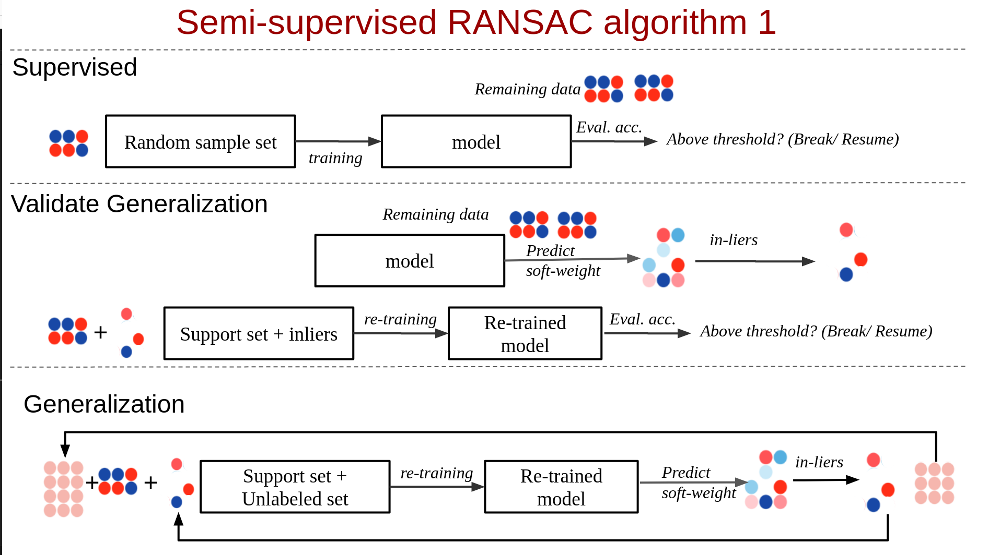
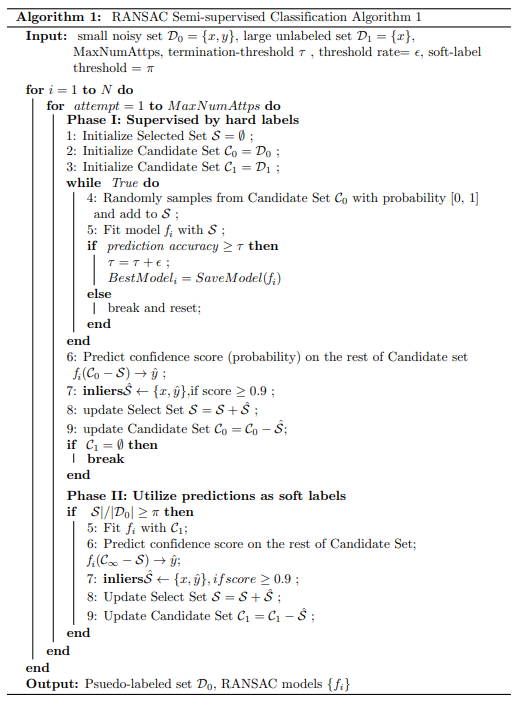
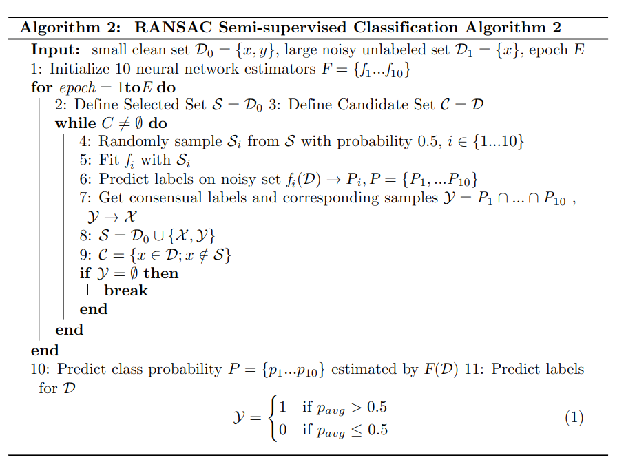

## RANSAC(Random Sample Concensus) inspired semi-supervised algoirthm.   ##

### Motivation ###
Acquiring high-quality label is one of the most critical bottle-neck of machine learning. It is time-cosuming and costly to obtain accurate, exact, and sufficient amount of labels. Sometimes, we have to make do with a lot of noisy labels with a handleful of "ground-truths." Semi-supervised learning aims at dealing with this category of problem by utilizing unlabeled data into training under the premise that there's a data manifold under the large amount of unlabeled data to levergage. We proposed two algorithms that utilize the concept of random sampling and self-training to enhance the prowness of our models. The algorithms are robust to most semi-supervised learning tasks even the ground-truths are as few as ten.   

###Introductions to Algoirhtms

### Algorithm 1: RANSAC1 ###

 The algorithm is updated based on the Three-stage-learning : Supervision, Supervised-generalizatoin,
 Transductive-Generalization.

 Supervision : randomly samples training set and train a weak classifier.

 Supervised-generalization : validate the the weak model with remaining labels
 (which might not be necessary, because it prevents diversification)

 Inductive-Generalization : weakly-supervised model use decision boundary or
 probability estimate to assign confience values to unlabeled data. Under the assumption
 of sufficient training epochs. There exists a good subset of training samples that
 best generatlized to the unlabled data by excluding low confidence samples from
 the pseudo-labels. The other approach is to include high confidence samples to the
 pseudo-labels. The former is called substractive labeling, the later is called
 additive labeling.

#### dcs_fn_ransac_estimator.py

Version 1 of RANSAC1

#### dcs_fn_ransac_estimator_2.py 
Improvements:
[Version2](docs/dcs_fn_ransac_estimator_2.md) 

#### dcs_fn_ransac_class2.py
Improvements:
[Version3](docs/dcs_fn_ransac_class2.md) 

### Algorithm 2: RANSAC2 ###

<figure>

	
Fig.4 - RANSAC Algorithm 2:

Step 1: RANSAC2 combines bagging and active learning. Initially N base classifiers were trainined separately with irreplacable random samples from the training data. The rest of training data are considered unlableld.

Step 2: Then the base classifiers use 'bagging' to generate concensus as pseudo labels.

Step 3: The psudolabels then are added to the sample sets in the next iteration of all base classifiers.

Step 4: The process is repeated untill all unlabeled data are labeled.

#### ransac_simple.py 

First Version 

The models takes fully labeled data set where labels are 'noisy'. 

The SSL model then 'denoise' the data set in the fashion of 'bagging' and active learning.

#### ransac_simple_v2.py

Version 2 is developed on top of verison 1.
	
Improvements :[Version2](docs/ransac_simple_v2.md) 

    

#### ransac_simple_v3.py

Version 3 is developed on top of verison 2.

Improvements :[Version3](docs/ransac_simple_v3.md) 

		
#### ransac_simple_ssl_v3.py (alpha version)

This version 3 is developed on top of version 3. (fork form ransac_simple_v3.py)

Improvements :Improvements :[Version4](docs/ransac_simple_ssl_v3.md) 

#### ransac_simple_new.py
	
Ransac Simple Algorithm2 (fork from ransac_simple.py)

RANSAC semisupervised learning utilizing unlabeled data.
