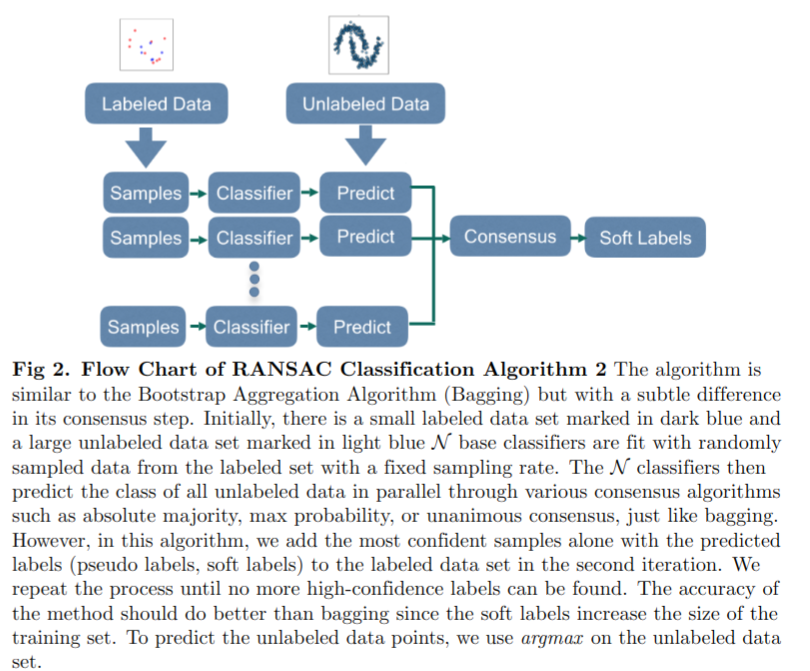

## RANSAC(Random Sample Concensus) inspired semi-supervised algoirthm.   ##

### Motivation ###
Acquiring high-quality labels is one of the most critical bottlenecks in machine learning. It is time-consuming and costly to obtain accurate, precise, and a sufficient amount of labels. Sometimes, we have to make do with a lot of noisy labels with a handful of "ground truths." Semi-supervised learning aims to deal with this category of problems by utilizing unlabeled data in training under the premise that there's a data manifold underlying the large amount of unlabeled data to leverage. We propose two algorithms that utilize the concept of random sampling and self-training to enhance the prowess of our models. The algorithms are robust to most semi-supervised learning tasks, even when the ground truths are as few as ten.

###Introductions to Algoirhtms

### Algorithm 1: RANSAC1 ###

 The algorithm is updated based on the Three-stage-learning : Supervision, Supervised-generalizatoin,
 Transductive-Generalization.

 Supervision : randomly samples training set and train a weak classifier.

 Supervised-generalization : validate the the weak model with remaining labels
 (which might not be necessary, because it prevents diversification)

 Inductive-Generalization : weakly-supervised model use decision boundary or
 probability estimate to assign confience values to unlabeled data. Under the assumption
 of sufficient training epochs. There exists a good subset of training samples that
 best generatlized to the unlabled data by excluding low confidence samples from
 the pseudo-labels. The other approach is to include high confidence samples to the
 pseudo-labels. The former is called substractive labeling, the later is called
 additive labeling.

#### dcs_fn_ransac_estimator.py

Version 1 of RANSAC1

#### dcs_fn_ransac_estimator_2.py 
Improvements:
[Version2](docs/dcs_fn_ransac_estimator_2.md) 

#### dcs_fn_ransac_class2.py
Improvements:
[Version3](docs/dcs_fn_ransac_class2.md) 

### Algorithm 2: RANSAC2 ###

	
Step 1: RANSAC2 combines bagging and active learning. Initially N base classifiers were trainined separately with irreplacable random samples from the training data. The rest of training data are considered unlableld.

Step 2: Then the base classifiers use 'bagging' to generate concensus as pseudo labels.

Step 3: The psudolabels then are added to the sample sets in the next iteration of all base classifiers.

Step 4: The process is repeated untill all unlabeled data are labeled.

#### ransac_simple.py 

First Version 

The models takes fully labeled data set where labels are 'noisy'. 

The SSL model then 'denoise' the data set in the fashion of 'bagging' and active learning.

#### ransac_simple_v2.py

Version 2 is developed on top of verison 1.
	
Improvements :[Version2](docs/ransac_simple_v2.md) 

    

#### ransac_simple_v3.py

Version 3 is developed on top of verison 2.

Improvements :[Version3](docs/ransac_simple_v3.md) 

		
#### ransac_simple_ssl_v3.py (alpha version)

This version 3 is developed on top of version 3. (fork form ransac_simple_v3.py)

Improvements :Improvements :[Version4](docs/ransac_simple_ssl_v3.md) 

#### ransac_simple_new.py
	
Ransac Simple Algorithm2 (fork from ransac_simple.py)

RANSAC semisupervised learning utilizing unlabeled data.

## Getting Started
Make sure you have python3, numpy, and scikit-learn packages installed.

## Usage
Clone and use either of the .py script above to port to your binary classification tasks.

The labeled data are annotated as 0, 1,

The unlabled data are annotated as -1

You can swap the base classifiers among SVM, KNN, or Multi-layer Perceptron

## Contributing

We welcome contributions from the community! If you'd like to contribute to this project, please follow these steps:

1. Fork the repository.
2. Create a new branch for your feature or bug fix.
3. Make your changes and commit them with clear and concise commit messages.
4. Push your changes to your fork.
5. Open a pull request against the main repository with a description of your changes.
6. Wait for a maintainer to review your pull request and provide feedback.

For more details on how to contribute, please see our [CONTRIBUTING.md](CONTRIBUTING.md) file.

## License

This project is licensed under the [MIT License](LICENSE). This means you are free to use, modify, and distribute the project, provided you include the original license and copyright notice in any copies or substantial portions of the software.

For more details, see the [LICENSE](LICENSE) file.

## Contact

If you have any questions or feedback, feel free to reach out to us:

- [Po-Hsuan Huang](mailto:pohsuanh@usc.edu)
